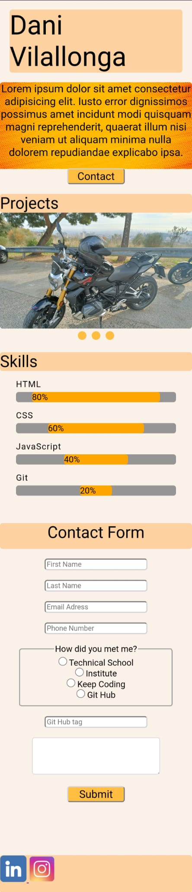
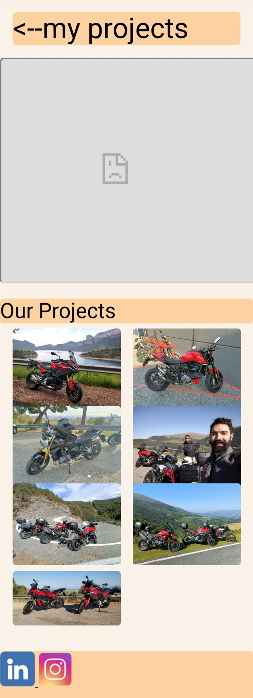

<!--
*** https://www.markdownguide.org/basic-syntax/#reference-style-links
-->

<!-- PROJECT LOGO -->
 

  

<h3 align="center">HTML/CSS Practice</h3>

  

    Second practice for the KeepCoding bootcamp
  

<!-- TABLE OF CONTENTS -->

  
Table of Contents

  <ol>
    <li>
      <a href="#about-the-project">About The Project</a>
      <ul>
        <li><a href="#built-with">Built With</a></li>
      </ul>
    </li>
    <li>
      <a href="#getting-started">Getting Started</a>
      <ul>
        <li><a href="#prerequisites">Prerequisites</a></li>
        <li><a href="#installation">Installation</a></li>
      </ul>
    </li>
    <li><a href="#contributing">Contributing</a></li>
    <li><a href="#contact">Contact</a></li>
  </ol>

<!-- ABOUT THE PROJECT -->
## About The Project

### Built With

<ul>
    <li>HTML 5</li>
    <li>CSS 3</li>
</ul>

(<a href="#top">back to top</a>)

<!-- GETTING STARTED -->
## Getting Started

To start navigating the website simply execute the index.html file in any browser or acces <a href="https://vilallonga.cat">vilallonga.cat</a>.

### Prerequisites

You may need Visual Studio or any other code editor of your choice.

### Installation

You do not require any specific software.

(<a href="#top">back to top</a>)

<!-- CONTRIBUTING -->
## Contributing

I apreciate the help of my fellow classmates, the teacher, my brother and Google (amen) for their assistance and great advice.

(<a href="#top">back to top</a>)

<!-- CONTACT -->
## Contact

Dani Vilallonga - dani@vilallonga.cat

Project Link: [https://github.com/DaniVilallonga/PracticaHtml](https://github.com/DaniVilallonga/PracticaHtml)

(<a href="#top">back to top</a>)
